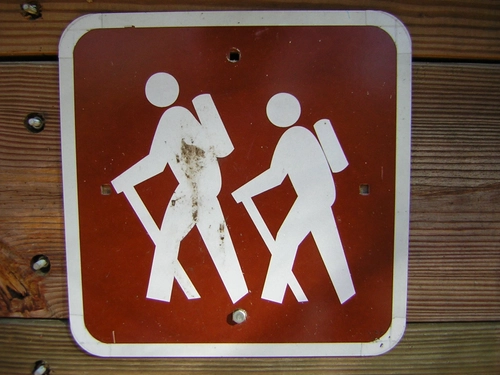

Last Updated: 2024-06-22

[< 🏠: Back to API Overview](index.html)

With Hikemap, you can track favorite hiking trails and discover new trails based on location and difficulty.

**Trails** have the following attributes:
* Name
* Description
* Location (City/State)
* Difficulty Level (Easy, Medium, Hard)
* Length (Miles)
* Elevation Gain (Feet)
* Image (URL)

Users can rate hikes on a **1 (worst) to 5 (best) rating scale and add a short review**.

We collect the following information about **users**:
* Username (also the display name)
* Email address